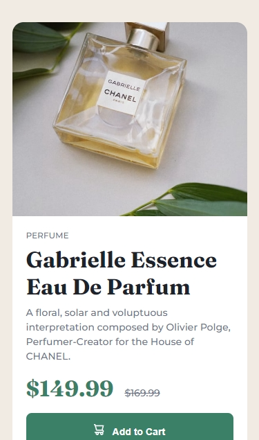
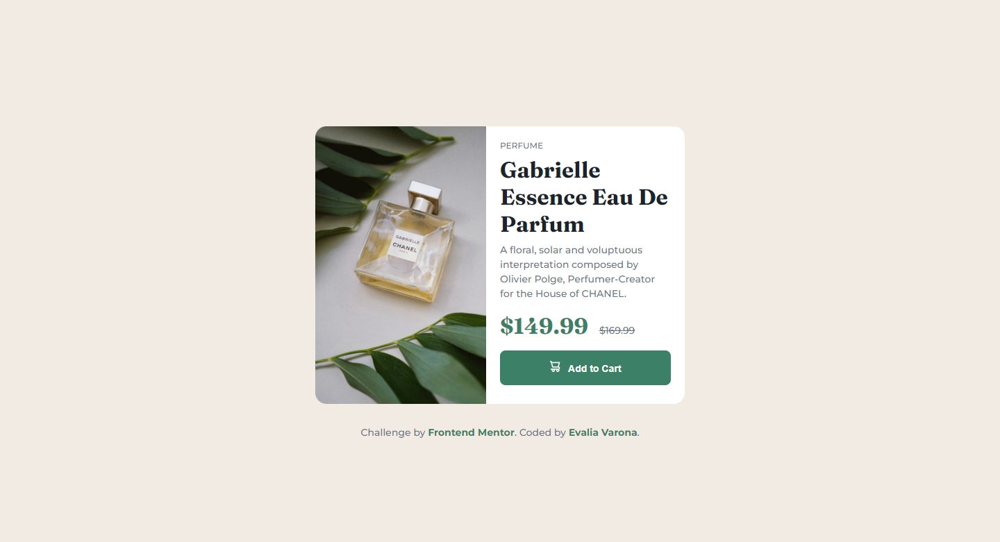

# Frontend Mentor - Product preview card component solution

This is a solution to the [Product preview card component challenge on Frontend Mentor](https://www.frontendmentor.io/challenges/product-preview-card-component-GO7UmttRfa). Frontend Mentor challenges help you improve your coding skills by building realistic projects. 

## Table of contents

- [Frontend Mentor - Product preview card component solution](#frontend-mentor---product-preview-card-component-solution)
  - [Table of contents](#table-of-contents)
  - [Overview](#overview)
    - [The challenge](#the-challenge)
    - [Screenshot](#screenshot)
    - [Links](#links)
  - [My process](#my-process)
    - [Built with](#built-with)
    - [What I learned](#what-i-learned)
    - [Continued development](#continued-development)
    - [Useful resources](#useful-resources)
  - [Author](#author)

## Overview

### The challenge

Users should be able to:

- View the optimal layout depending on their device's screen size
- See hover and focus states for interactive elements

### Screenshot




### Links

- Solution URL: [GitHub Repository](https://github.com/varonalearns/Product-preview-card-component)
- Live Site URL: [Vercel Live Site](https://product-preview-card-component-rust.vercel.app/)

## My process

### Built with

- Semantic HTML5 markup
- CSS custom properties
- Flexbox
- Mobile-first workflow

### What I learned

- I learned, through this project, how to strikethrough text. A simple thing to accomplish but something I did not know how to do until now. Here is an example:

```
.reg {
    text-decoration: line-through;
}
```

- I ran into some issues with centering the card component in the middle of page. The following code, however, allowed me to do just that. What I was missing was setting the width to 100vw (which is viewport width that works like a percentage unit) and min-height to 100vh (viewport height):

```
body {
    display: flex;
    flex-direction: column;
    justify-content: center;
    align-items: center;
    width: 100vw;
    min-height: 100vh;
}
```

### Continued development

Use this section to outline areas that you want to continue focusing on in future projects. These could be concepts you're still not completely comfortable with or techniques you found useful that you want to refine and perfect.

### Useful resources

- [Strikethrough text with CSS](https://www.tutorialspoint.com/Strikethrough-text-with-CSS) - This article gave me a quick example of how to create strikethrough text.

- [Centering Elements](https://dev.to/ayushmanbthakur/different-ways-to-center-a-div-in-a-webpage-5enn) - This article helped me understand why the elements on the webpage would not center.

## Author

- Website - [Evalia Varona](https://www.evaliavarona.com)
- Frontend Mentor - [@varonalearns](https://www.frontendmentor.io/profile/varonalearns)
- Hashnode - [@evavarona](https://evaliavarona.hashnode.dev/)
